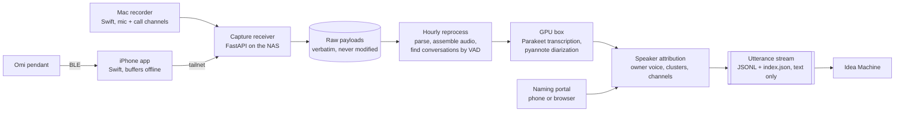

# hearsay

Who said what, when. Hearsay turns recorded conversations into attributed transcripts.

Audio comes from a wearable pendant (through an iPhone app) and a Mac menu-bar recorder. Hearsay
finds the conversations in it, transcribes them, separates the speakers, works out which turns are
mine, and lets me put names to everyone else. The output is a text-only stream of utterances that
downstream tools read. [Idea Machine](https://github.com/junglestyle/ideamachine) is the first of
those. All of it runs on my own hardware, and no audio ever goes to a third party.

## Consent and privacy

Hearsay records conversations with the consent of the people in them. The controls are built in:

- A tap on the pendant pauses recording or mutes its mic in hardware. Paused audio doesn't reach
  the server unless I choose to upload it.
- The Mac recorder asks before it records a Zoom call, and runs only on my personal Mac, never a
  work machine.
- Audio stays inside my home network and tailnet. It never goes to a cloud service or to
  downstream tools. They get text only.
- Places are stored as names I choose, never coordinates. Other people's tone of voice is never
  inferred.
- `forgotten.json` is the deletion signal for consumers. Deleting old audio on a rolling window is
  the next slice on the [roadmap](docs/roadmap.md#12-retention).

## How it works

## The interesting parts

- **Precision over coverage in speaker attribution.** I tune the owner and not-owner voice thresholds
  against segments I've labeled by ear. Disagreements get re-heard blind, and a report shows
  precision at each threshold. A turn that can't be called stays unlabeled rather than guessed.
- **Everything rebuilds from raw.** Webhook and upload payloads are written to disk byte for byte
  before any parsing. Every hour the whole database is rebuilt from them into a staging copy, which
  is swapped in only when it's complete. Slow steps are cached by audio content.
- **A real contract for consumers.** The stream has a format version and atomic writes. Each file
  carries a content-hash revision so a reader can detect a race. A separate transcript revision says
  when utterance ids get renumbered, and there's an append-only forget list. Names apply
  retroactively, so the unit of change is a whole conversation.
- **Attribution from more than one signal.** Voice embeddings decide first. Mac recordings also
  know which channel a turn was loud on, and short turns inherit their diarized speaker's label.
  Places and tagged media only *suggest* names in the portal. They never name anyone on their own.
- **Native capture.** The iOS app keeps the pendant connected in the background, uploads every
  minute, and holds audio on the phone when the server is unreachable. It also downloads what the
  pendant stored while out of range and places it by the pendant's clock.

## Stack

Python 3.12, FastAPI, SQLite, NVIDIA Parakeet (NeMo), pyannote, SpeechBrain, Silero VAD, Swift
(iOS and macOS), Docker on TrueNAS, Tailscale, Cloudflare Tunnel. 45 tests on synthetic fixtures,
run in CI.

## Running it

It's built for one operator's setup: a NAS, a GPU box, an iPhone and a Mac. The install and
operating guide is in [docs/install.md](docs/install.md), and the build history is in
[docs/roadmap.md](docs/roadmap.md).

## Status

Under active development. The current work is the owner's tone of voice (slice 16) and place-based naming hints
(slice 14).
